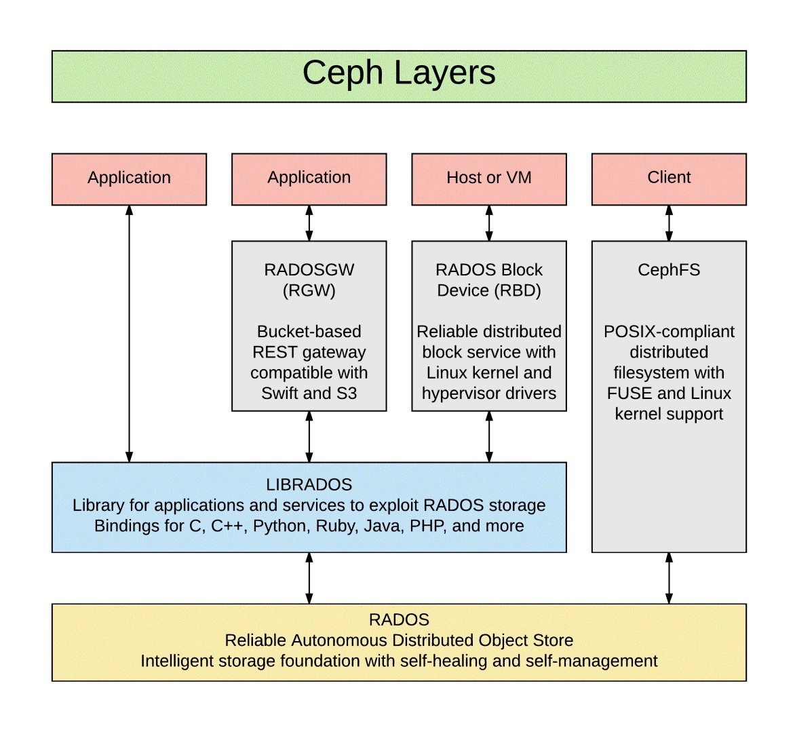

# Lab4

在本次实验中，我们将从 Ray（计算相关）和 Ceph（存储相关）中**二选一**进行部署、测试、分析、评价等各项工作

- 选定一个与选题对应的计算类/存储类测试任务（1 分）。Ceph 自带测试模块，可以直接使用。Ray 需要自行设计测试过程，可以参考其自带少部分样例。亦可选择其他第三方测试工具。
- 拟定一份计算类/存储类对应的性能指标列表（不少于 5 个指标，如延迟、IOPS 等），根据测试任务，从中选择至少两个指标进行后续测试，并说明所选指标的合理性（1 分）。
- 完成单机版部署并进行性能测试（5 分）。
- 基于已有部署进行分析，进行测试和优化（2 分）。优化以 Ray 或 Ceph 本身的配置参数修改为主，不必修改底层系统环境，但需给出相应分析。提供截图说明单机优化后性能较初始部署提高 20%（1 分）。
- 完成分布式部署并进行性能测试（1 分）。
- 基于 Docker 完成分布式部署并进行性能测试（1 分）。
- 将撰写的相关报告发布到公开媒体，如 CSDN、知乎或是自己的博客、channel（1 分）。

## 实验要求与 DDL

本次实验以大作业分组为单位完成，每组提交一份部署说明文档，一份性能测试和分析文档（若有优化设计更好），并给出有数据支撑的优缺点评价，无需提交代码，文档文件命名不限制。

文档放在大作业的仓库中即可。

本次实验满分 12 分。所获总分如果高于 12 分，将被截断为 12 分。

此次实验截至时间为 6 月 13 日 23:59。

## 相关资料

Ray 的相关介绍：https://zhuanlan.zhihu.com/p/399209343

> Ray 是伯克利大学 RISELab 研发的分布式计算系统，我愿称之为“AI 时代的 Spark”。
>
> 按照官方文档的说法：
>
> > Ray provides a simple, universal API for building distributed a>pplications.
>
> 为什么说 Ray 是一个简单高效的分布式计算引擎呢？它主要有以下的特点：
>
> - 提供一种能够构建、运行分布式应用程序的 simple primitives；
> - 从单机扩展到平行，几乎不需要改代码；
> - 拥有良好的生态，能够在 core Ray 上构建复杂的应用程序。
>
> 我们说 Ray 能够让开发者轻松的构建分布式变成，靠的是两样法宝（计算原语）：
>
> - Task：一个无状态的计算任务（函数表示）。Ray 允许异步执行任意函数。这些“remote function”（Task）的开销非常低，可以在毫秒内执行，并且可以自动向集群添加节点并调度任务，非常适合扩展计算密集型应用程序和服务。
> - Actor：一个有状态的计算任务（类表示）。Actor 模型是一个强大的异步编程范例（支持微服务），可以在本地和远程无缝工作。Actor 本质上是一个有状态的 Worker（或 service）。当一个新的 Actor 被实例化时，就创建一个新的 Worker，并将该 Actor 的方法调度到这个特定的 Worker，也可以对 Worker 的状态进行访问和修改。

Ceph 的相关介绍：https://github.com/OSH-2021/osh-2021.github.io/tree/main/lab-4

> Ceph 是 Dr. Sage Weil 在其博士毕业论文中设计的开源分布式存储文件系统，经过不断地发展，更多新的特性被加入到当中来。14 年 Ceph 被 Redhat 公司收购，如今已经被广泛用作后端存储系统为上层应用提供支持。该系统被期望设计为没有单点故障的完全分布式存储系统，使数据能容错和无缝的复制，可扩展至 EB 水平(EB, PB, TB, GB)。Ceph 摒弃了传统的集中式元数据寻址方案，取而代之是使用 CRUSH(Controlled Replication Under Scalable Hashing)算法进行数据寻址操作，CRUSH 在一致性哈希基础上很好地实现了容灾隔离，机架感知。扩展性强，理论上支持上千个存储节点。Ceph 支持对象存储，块存储和文件存储，支持自定义接口，多语言驱动，同时其去中心化的设计实现了高可扩展性，副本数量灵活控制实现在不同场景下的高可用性。其基本组件如下：
>
> 